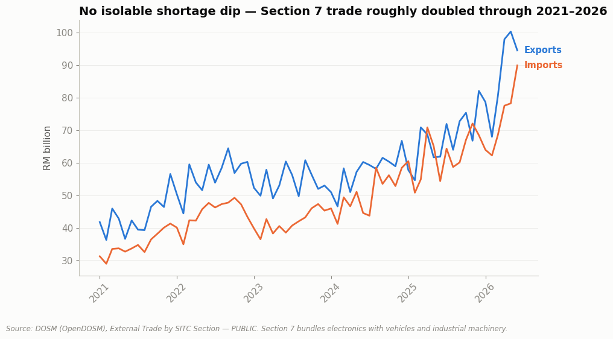

# Malaysia Semiconductor Shortage: Trade & Manufacturing Impact (2021–2023)

**The global chip shortage made headlines everywhere from 2021–2023 — but it left no visible mark on Malaysia's own trade and manufacturing data.** This project tests that gap between headline and data directly.



**Part of a [8-case-study portfolio](https://github.com/ooi-darren)**. See the other seven.

## The Question

How did the 2021–2023 global semiconductor shortage affect Malaysia's electrical & electronics (E&E) export performance, and what does the recovery pattern reveal about supply chain resilience for businesses operating here?

## Status

✅ **Analysis complete.** Two notebooks, the first testing the shortage's impact across trade and manufacturing data, the second stress-testing that finding against an economy-wide baseline.

## Key Findings

**1. Neither trade nor manufacturing data shows an isolable "shortage hits, then recovers" signature.** Both Section 7 (Machinery & Transport Equipment) trade values and Division 26 (Computer, Electronic & Optical Products) manufacturing output are continuously volatile across the entire 2021–2026 window: the dip observed in early 2023, initially suspected to be the shortage's mark, turns out to be indistinguishable from the sector's normal cyclical swings once compared against a longer baseline. Both series also show substantial growth well beyond pre-shortage levels: Section 7 trade roughly doubled from 2021 to 2026, and Division 26 manufacturing output rose from a 2021 range of ~120–170 to consistently above 190 by 2025–2026. *([Notebook 01](./notebooks/01-chip-shortage-trade-and-manufacturing-impact.ipynb))*
**Why:** Malaysia specializes in chip assembly, testing, and packaging (the "back-end"), not the front-end chip fabrication that actually ran short; demand for that back-end capacity stayed strong throughout as manufacturers everywhere scrambled to get whatever chips they could actually built and shipped. *(Full explanation in Notebook 01's "Why Is This Happening?" section.)*

**2. Division 26's volatility isn't electronics-specific; it's structural to Malaysian manufacturing broadly.** Comparing Division 26 against the national headline Industrial Production Index shows close co-movement across the entire 2021–2026 window: the same seasonal dips (clustering early each calendar year, consistent with widely-documented Chinese New Year production slowdowns across Malaysian industry generally) and the same overall upward trajectory. This strengthens Notebook 01's conclusion: the absence of an isolable shortage effect isn't a limitation of the data; it reflects that electronics manufacturing's volatility is business-as-usual for the sector it belongs to. *([Notebook 02](./notebooks/02-electronics-vs-economywide-manufacturing-volatility.ipynb))*

## Explain It Simply

Around 2021, the world ran short of computer chips, the tiny parts inside phones, cars, and almost every electronic device. News headlines said this "chip shortage" hurt factories everywhere. Malaysia makes a lot of the world's chips, so this project asks a simple question: does that shortage actually show up in Malaysia's own trade and factory numbers?

Surprisingly, **no**, not in a way you could point to on a chart and say "there, that's the shortage." Malaysia's electronics exports and factory output were bumpy throughout, but they were bumpy *before* the shortage and *after* it too, and they kept growing bigger overall rather than shrinking. Digging deeper explains why: Malaysia mostly does the "assembly and testing" step of chip-making, not the step that actually ran short, so while other parts of the world struggled to get raw chips, factories everywhere still needed Malaysia to assemble and test whatever chips they *could* get, keeping Malaysia's own numbers busy either way.

The lesson for a business: a global crisis making headlines doesn't automatically mean every country in that supply chain gets hit the same way; where exactly you sit in the chain matters more than the headline. (New to terms like "back-end" or "IPI"? See the [Glossary](#glossary) near the bottom.)

## Why This Project

A chip shortage is a textbook supply chain disruption story, but most public narratives about it stay qualitative ("factories struggled to get components"). This project tests that narrative against actual national trade and manufacturing data for Malaysia specifically, asking not just "did this happen" but "does it show up in the numbers, and if so, how", and stress-tests its own conclusions against a wider baseline rather than accepting the first result at face value.

## Data Sources

All three datasets are labeled **PUBLIC** (official government source). Full definitions and known limitations are documented in [`DATA_DICTIONARY.md`](./DATA_DICTIONARY.md).

| Dataset | Source | Classification | Frequency |
|---|---|---|---|
| Trade by SITC Section (1-digit) | DOSM (OpenDOSM) | PUBLIC | Monthly |
| Industrial Production Index by MSIC Division (2-digit) | DOSM (OpenDOSM) | PUBLIC | Monthly |
| Industrial Production Index (headline, economy-wide) | DOSM (OpenDOSM) | PUBLIC | Monthly |

**Real limitations, stated plainly rather than buried:** Section 7 ("Machinery and Transport Equipment") is a broad trade category that bundles electronics with unrelated goods like vehicles and industrial machinery; it's a proxy for electronics trade, not an isolated figure. The headline IPI is broader still, covering mining and electricity alongside all manufacturing, not just electronics. Both asymmetries are discussed directly in the notebooks' Confidence & Caveats sections.

## Notebooks

| # | Question | Data Rigor |
|---|---|---|
| [01: Trade & Manufacturing Impact](./notebooks/01-chip-shortage-trade-and-manufacturing-impact.ipynb) | Did the 2021–2023 chip shortage leave a visible mark on Malaysia's E&E trade and manufacturing, and what does the recovery reveal about resilience? | PUBLIC |
| [02: Electronics vs. Economy-Wide Volatility](./notebooks/02-electronics-vs-economywide-manufacturing-volatility.ipynb) | Is Division 26's volatility unusual for electronics, or structural to Malaysian manufacturing broadly? | PUBLIC |

## Methodology

Business problem → objectives → data acquisition → cleaning → analysis → visualization → insight → recommendation. Each notebook opens with the question and the answer, then shows the reasoning between them, including hypotheses that didn't hold up, and findings used to stress-test earlier conclusions rather than just add to them.

## Reproducing This Analysis

```bash
pip install -r requirements.txt
jupyter notebook notebooks/
```

All data used is already included in `data/raw/`; notebooks read directly from there, so no external downloads are required to re-run the analysis. Unlike other repos in this portfolio, this case study's data needed no cleaning or compilation before analysis (OpenDOSM's CSVs were already analysis-ready as downloaded), so there is no separate `data/processed/` folder here.

## Repository Structure

```
data/
└── raw/          # Original files, unmodified, as downloaded from source, already analysis-ready
notebooks/        # Analysis notebooks
DATA_DICTIONARY.md
```

## Glossary

Plain-language definitions for the technical terms used in this project.

- **Chip / semiconductor:** The small electronic component that powers almost every modern device: computers, phones, cars, appliances.
- **"Back-end" (assembly, testing, packaging):** The later stage of making a chip, taking a finished silicon wafer, cutting it up, testing each piece works, and packaging it so it can be soldered onto a circuit board. Malaysia specializes in this stage, not in designing chips or fabricating the raw silicon wafers (the "front-end").
- **IPI (Industrial Production Index):** A single number that tracks how much a country's factories are producing overall, published monthly, used to compare production levels across time.
- **Section 7 / Division 26:** Official statistical categories used by Malaysia's government to group trade and manufacturing data. Section 7 bundles electronics together with unrelated goods like vehicles and machinery; Division 26 is a narrower, electronics-specific category.
- **PUBLIC:** A number in this project taken directly from an official government source, with nothing estimated or hand-compiled. See [`DATA_DICTIONARY.md`](./DATA_DICTIONARY.md) for full detail.

## Author

Darren Ooi, [LinkedIn](https://www.linkedin.com/in/darrenooizhixian)